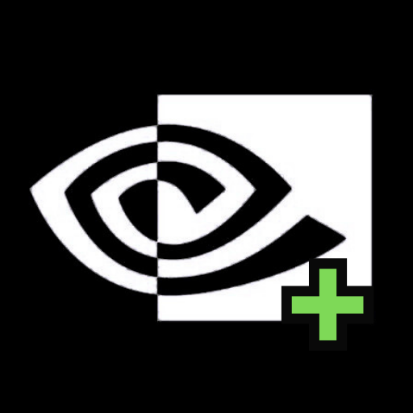

  

# Better GFN

> Mejoras de experiencia para GeForce NOW en navegador y Android
> by **Karmadev0**

---

## ¿Qué es Better GFN?

Better GFN es una extensión de navegador y aplicación Android que mejora la experiencia de juego en [GeForce NOW](https://play.geforcenow.com) — el servicio de cloud gaming de NVIDIA.

La idea principal está inspirada en [**Better xCloud**](https://github.com/redphx/better-xcloud) de **@redphx**, un proyecto increíble que hace lo mismo para Xbox Cloud Gaming. Todo el crédito del concepto original pertenece a ese proyecto. Better GFN es una adaptación independiente orientada específicamente a GeForce NOW.

---

## Features actuales (v1.0.0)

### Timer de sesión
- Reloj en tiempo real siempre visible
- Contador de tiempo de sesión activa
- Tiempo restante con barra de progreso
- Alertas automáticas a los 50 min (amarillo) y 55 min (rojo)
- Reset automático cuando GFN se reinicia

### (inestable) Eludir bloqueo de región
- Por los momentos no funciona como better xcloud de que se hace todo en la app pero tenemos avisos visibles sobre el que hacer con tu propia vpn
- Aviso automático cuando la sesión se establece: **"Ya puedes desconectar tu VPN"**

### Optimización de mando
- Detección automática del tipo de mando: Xbox, PlayStation, Nintendo, Genérico
- Remapeo de botones al estándar Xbox que GFN espera
- **High-frequency polling** ajustable para reducir input lag en Bluetooth:
  - Nativo (~60 Hz)
  - Alto (~120 Hz)
  - Ultra (~250 Hz) — recomendado para BT
  - Max (sin límite)
- Opción A↔B para mandos PlayStation

### UI adaptativa
- Mini widget (tiempo restante) en esquina superior izquierda durante el juego en fullscreen
- Widget flotante con info completa durante carga/pausa
- Botón FAB `⚙ BETTER GFN` en el menú principal que abre el panel de opciones
- Panel deslizable desde abajo con toda la configuración
- Toda la configuración se guarda automáticamente

---

## Instalación

### Opción A — Extensión para Chrome
1. Descarga el ZIP de la última release
2. Abre tu navegador in-browser → `chrome://extensions/`
3. Activa **Modo desarrollador**
4. Click en **`+ (from .zip/.crx/.user.js)`**
5. Selecciona el ZIP descargado

### Opción B — APK Android (este repo)
1. Ve a la ultima versión de Releases y busca el archivo APk 
2. Instala el APK en tu dispositivo (necesitas permitir fuentes desconocidas)

---

## Roadmap / Ideas futuras

Por los momentos estos son los que quiero agregar, si quieren darme ideas, soy todo oidos

### Estadísticas mejoradas
- Latencia en tiempo real (ping al servidor de GFN)
- Bitrate del stream actual
- FPS del stream
- Calidad de conexión en vivo
- Historial de sesiones

### Mapeo de botones táctiles nativo
- Sincronizar los botones táctiles del OSC de GFN con el mando físico
- Los botones táctiles tienen 0 input lag — integrarlos con el gamepad físico
- Perfiles de mapeo guardables por juego

### Región / Servidor
- Selector visual de servidor integrado en el panel (sin salir a ajustes de GFN)
- Ping en tiempo real a cada servidor disponible
- Recordar servidor preferido por juego
- Poder eludir el bloqueo de ip directamente en la misma app
- selector de servidor con ping para dar el mejor servidor de GFN para jugar, en base a su cola y su ping

### Personalización del entorno GFN
- Temas visuales para la interfaz de GFN (colores, fondos)
- Ocultar/mostrar elementos de la UI de GFN
- Widgets personalizados arrastrables en pantalla
- Notificaciones para avisos de GFN como que se acaba la cola, que se va a acabar el tiempo, etc

### Rendimiento
- Forzar resolución y bitrate máximo disponible
- Modo bajo consumo (reducir polling cuando la batería es baja)
- Optimizaciones específicas para juegos individuales

---

## Aviso legal

El uso indebido de esta herramienta es responsabilidad exclusiva del usuario.
Better GFN está diseñado únicamente para mejorar la experiencia de juego en GeForce NOW.
GeForce NOW y todos sus servicios son propiedad de **NVIDIA Corporation**.
Better GFN no está afiliado ni respaldado por NVIDIA.

La idea original del concepto pertenece al proyecto [**Better xCloud**](https://github.com/redphx/better-xcloud) de **@redphx**.

---

**Karmadev0**
Si tienes ideas, sugerencias o encuentras bugs, abre un Issue en este repo.
